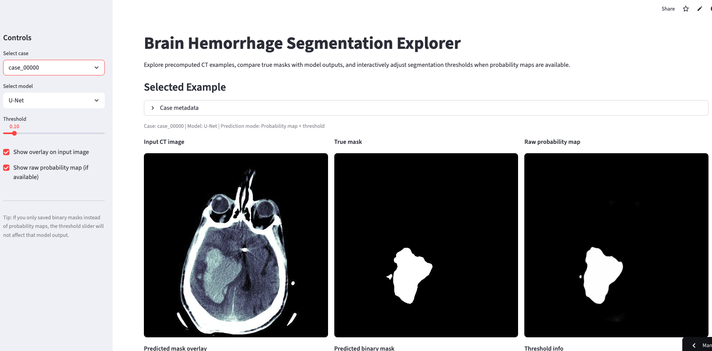
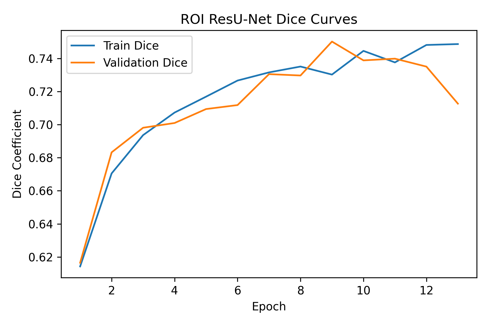
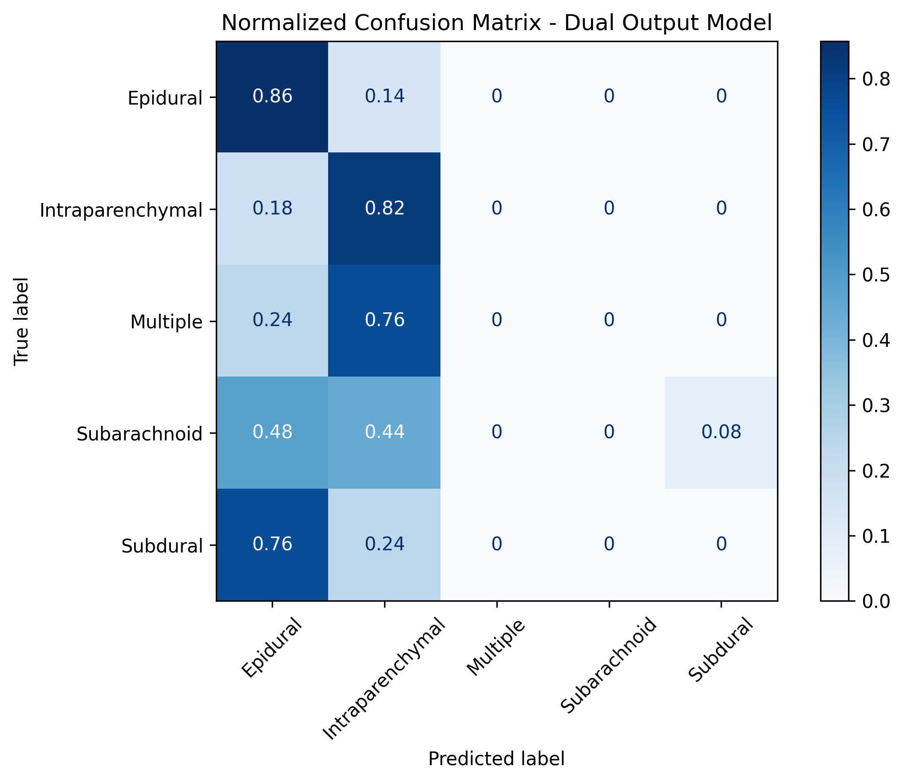

# Brain Hemorrhage Segmentation App
An app for exploring results of predicted binary masks of hemorrhages based on CT scans of the brain with true binary masks. If the app has not been recently active, it may take up to 30 seconds to load or the pressing of the reactivation button.

[Explore App and Project Results Here](https://brain-hemorrhage-segmentation-app-fxuflb7mf9tyusncpubyjp.streamlit.app/)

A preview of the app is shown below.

## Overview

In this project a machine learning pipeline was developed for brain hemorrhage analysis from CT scans, and combined methods of computer vision and image segmentation models as well as traditional machine learning approaches. The project focused both on predicting binary masks correlated with five subtypes of hemorrhages as well as hemorrhage classification. At its end, an interactive web application was deployed to visualize results of the project.

The paper that accompanies this project can be read by clicking the link below.

[Read Project Paper](Brain_Hemorrhage_Segmenation_and_Classification_with_Machine_Learning.pdf)

## Objectives

The objective of the project was to segment hemorrhage regions in brain CT scans and compare the performance results of both U-Net and ResU-Net segmentation models. Additionally, traditional machine learning models such as linear regression, Random Forest, etc., were used for hemorrhage classification, leading to the analysis of challenges such as data leakage, class imbalance, and irrelevant engineered features. The final goal was to create an interactive interface for model exploration.

## Dataset

The dataset for this project was provided by the company Zeta Surgical, and was composed of CT brain scan images organized into multiple hemorrhage categories along with accompanying features such as polygon-related data in CSV format. Each scan had multiple views (such as brain window, bone window, etc.), and labels included hemorrhage type classifications as well as the quality of the label.

## Methodology - Segmentation

For the segmentation leg of this project, first polygon annotations were parsed from the dataset CSV files. The coordinates were converted into binary masks using OpenCV, and multi-view image inputs (stacked channels) were constructed, too. From there, a TensorFlow pipeline was built and a U-Net model was configured, and the model was then trained for segmentation and the task of predicting binary masks. After multiple iterations of the U-Net model were deployed, ResU-Net with residual connections rather than standard convolution layers was also implemented in an attempt to improve model accuracy. Model accuracy was evaluated using Dice coefficient and IoU (loss functions were BCE and Dice loss). 

A third iteration of modeling included using ROI cropping on the ResU-Net model to address class imbalance in terms of non-hemorrhage matter pixels and hemorrhage pixels (minority class). This allowed the narrowing down of input images to more relevant regions, still containing anatomical context for hemorrhages but also reducing background and healthy brain tissue pixels such that hemorrhages took up a larger percentage of the image. After the round of ROI cropping, a small-scale version of active learning was implemented with identifying the former model's weakest predictions and thus hardest cases, oversampling them, and having the model retrain on a more difficult training dataset to have it learn the difficult examples better. 

## Methodology - Classification

For the hemorrhage classification portion of the project, first, multiple CSV files were combined into a unified dataset and hemorrhage type labels were created at the row level for every associated image. Next, label inconsistencies were addressed (deciding whether to use 'Majority Label,' considered the best, or 'Correct Label' if no Majority Label was available), and features were engineered from the previously created segmentation masks, such as number of polygons per brain image, area statistics, and spatial and geometric features. The issue of data leakage was resolved by converting data from image-level to row-level, and multiple machine learning models (logistic regression, linear models, LDA/QDA, Neural Network/MLP, Random Forest) were trained with the task of accurately predicting hemorrhage type.

After this round of standard classification, the classification attempt was revisited using spatial and geometric features (number of polygons, polygon area, perimeter, std., centroid, etc.) using the masks generated by the ROI cropping with the expectation that the more accurate features would enhance classification performance of the model. Finally, data augmentation such as horizontal rotation of CT scans and contrast changes was implemented, as well as transitioning from Dice loss to Tversky loss. 

The final attempt at the classification task was the compilation of a dual-output model that performed two tasks simultaneously: pixel-level segmentation and hemorrhage classification. The model was based on standard ResU-Net encoder-decoder architecture, with the encoder shared between the segmentation and classification tasks. The model included a classification head, which took the high-level bottleneck features, applied global average pooling, converted spatial features into a vector, dense layers, and softmax output. The classification head then output a probability distribution over hemorrhage classes. The model in turn produced two predictions at once: one for classification and one for segmentation, as well as two losses (Dice + BCE for segmentation and cross entropy for classification. 

## Models Used

- U-Net (binary cross entropy loss/BCE)
- U-Net + BCE + Dice + IoU
- ResU-Net
- ResU-Net with ROI cropping
- ResU-Net with ROI cropping and Active Learning
- Logistic Regression
- Linear Regression (OLS, Ridge, Lasso)
- LDA/QDA
- Random Forest
- Neural Network/MLP
- Gradient Boosting Classifier
- Dual-Output model (ResU-Net ROI w/ shared encoder and two heads)

## Results

The BCE-only U-Net model failed in its creation of predictive masks due to accuracy being geared towards pixel-level instead of mask overlap, meaning the predicted probability of each pixel being a hemorrhage was low. At higher thresholds this resulted in blank masks, and at lower thresholds, noisy masks with irrelevant polygon area. Dice-based loss significantly improved image segmentation quality in the U-Net model, though the ResU-Net model showed negligible improvement. ResU-Net with the implementation of ROI cropping, however, significantly out-performed the other models, leading with a Dice coefficient of .76 while the others hovered at .67, indicating the importance of data preprocessing when building models and highlighting that improved model accuracy is not all about increasing the complexity of model architecture. Adding the active learning step to the ResU-Net with ROI-cropping model did not improve results and scored an identical Dice coefficient, indicating that for this task ROI cropping had already solved the problem the best it could be solved. Below is a graph of the validation and training Dice scores for the ResU-Net with ROI cropping model, showing immediate strong learning of hemorrhage material at the beginning of training and then tapering off as the model reached its limitations. 

The classification models initially demonstrated inflated performance due to probable data leakage as well as the deletion of polygon-related features during data cleaning. Once data leakage was fixed, however, and a host of engineered features were introduced, model performance dropped significantly, highlighting the role data leakage plays in falsely high accuracy as well as demonstrating that the engineered spatial features, while assumed to be relevant, were not strong enough to enhance predictions of hemorrhage type. 

The reworking of the classification task with features from the ROI-cropped masks did very little to improve classification, further implying that geometric and spatial feature alone were not enough to address the complexity of the classification task.

The dual output model performed the worst out of every iteration, with total class collapse into two classes and the demonstration of the inability to classify and hemorrhages beyond those two types. This is likely because identifying hemorrhage type is heavily reliant on the location of the hemorrhage in the brain, and while the cropping did preserve some minor local anatomical context, global anatomical context was loss, making the classification task extremely difficult. It is also possible that the shared encoder creating competition between the two objectives of classification and segmentation, and that even after a round of reweighting the loss functions to force the model to focus more on classification, it was not enough to overcome the issue. Below is a normalized confusion matrix of the dual-output model showing the class collapse. Classes were collapsed into epidural and intranparenchymal, with the multiple class being heavily confused with the latter of the two.

## Interactive App

An application was built using Streamlit that allows users to:

- View CT scans
- Compare true and predicted masks as well as probability maps
- Switch between U-Net, ResU-Net, and ResU-Net with ROI cropping models
- Adjust probability thresholds to observe their impact on mask quality

It is deployed in the cloud for public access. If the app has not been recently accessed, it may take a maximum of 30 seconds to load. The link is as follows:

[See App Here](https://brain-hemorrhage-segmentation-app-fxuflb7mf9tyusncpubyjp.streamlit.app/)

## Paper

Below is a link to the full paper that accompanies this project.

[Read Project Paper](Paper/Brain_Hemorrhage_Segmentation_and_Classification_with_Machine_Learning.pdf)

## How to Run Locally

- Clone repository
- Install dependencies from requirements.txt
- Run: streamlit run brain_hemorrhage_segmentation_explorer.py
- Open browser at local host

## Project Structure

- app_data -> folder with sample cases for visualization
- Paper -> folder that contains full paper associated with this project
- Images -> folder for images included in ReadME
- brain_hemorrhage_segmentation_explorer.py -> Streamlit app

## Future Improvements

- Improve segmentation with larger datasets
- Use pre-trained encoder backbones such as ResNet and EfficientNet
- Apply more advanced model architecture (attention U-Net, transformers)
- Implement more robust version of active learning with more rounds of resampling and human-in-the-loop review
- Address class imbalance more effectively (class weights, resampling, metrics such as F1 score, recall, precision)
- Train models for longer and more epochs
- Deploy real-time inference instead of precomputed results
